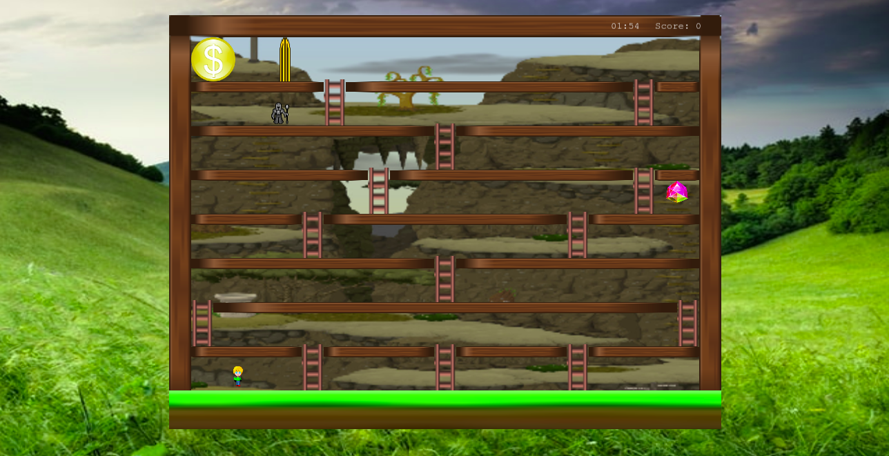

# Phaser 3 Game

> An game developed on the Phaser 3 framework. Our hero runs around collecting gems before they and him run out of lives. A villain could be hidden in one of the gems, and there is no way to tell. If he collects the gold coin, he will become very rich.



## Built With

- Phaser 3
- JavaScript
- HTML
- SCSS
- Webpack

## Live Demo

[Game](https://husler.netlify.app/)

## Getting Started

To get a local copy up and running follow these simple steps on the command line.

```bash

  # Clone the project from it's github repo.

  $ git clone https://github.com/chasscepts/phaser-game

  # Change directory to the root of project

  $ cd phaser-game

  # Install all dependencies

  $ npm install

  # Start webpack-dev-server (This will open the page in your browser)

  $ npm run serve

  # Run Tests

  $ npm run test

  # To build the project for production

  $ npm run build

```

## How to play

After the game finished loading, you will be taken to the title page. Enter your name in the field provided and click "Play Game" button.
Use the left, right, up and down arrow keys to control the movement of the hero. Collect the gems to increase your score. Sometimes a villain will hide in one of the gems, if you collect such gem, your character will die. If you collect the gold coin, your score will be multiplied by 50. But it is protected by a door that is periodically openned by an unknown force. The game ends when any of the following occurs.

- The game period of 5 minutes elapses.
- You collect a villain that is hidden in a gem.
- You collect the gold coin.

At the end of a game the score is uploaded to an external API. You can retrieve and view the scores in the Leaderboard scene which is accessed through the title page.

## Game Development Design

#### The guide below was drafted at the beginning of the project. It served as a guide to the features implemented in the project. A copy of the document can be found [here](./GDD.md). Though not all features has been implemented, the guideline was strctly followed.

# Trapped in a maze

- Our hero is trapped in a maze.
- He can collect silver and bronze coins that randomly appear (these disappear after some time).
- The gold coin is locked away in a room.
- The door to the gold room sometimes opens. (The game is timed and door should open at random times but opens a constant number of times in a game period)
- There are many rooms in the maze, some with 1 others with 2 doors. These doors can randomly close at any time.
- The villain is out to trap our hero in a room.
- The villan has an assistance who sometimes appears as an innocent coin.
- If our hero is able to collect the gold before time ellapses, his score is multiplied by 100.
- The odds of our hero being trapped if he just waits outside the gold room door should be made high.
- The game ends if
  1. Game time elapses.
  2. Our hero collides with the villain.
  3. Our hero collects the villain's assistance hidden in a coin.
- Silver and Bronze coins are worth 30 and 10 points each.

### Accomplishments so far

I have been able to implement most of the features I initially set out in the GDD. The major feature that is remaining is making the villain intelligent. This point is vaguely referenced in point 9 of the GDD. Currently, the villain has no knowledge of where the hero nor the gold coin is on the board. If I can make the villain intelligent, I will be able to add levels to the game by increasing how difficult the villain makes it for the hero to survive at higher levels.
But I ran out of time and was not able to accomplish all that.

## Authors

👤 **Obetta Francis**

[](https://github.com/chasscepts) [](https://twitter.com/chasscepts) [](https://www.linkedin.com/in/chasscepts/)

## 🤝 Contributing

Contributions, issues, and feature requests are welcome!

Feel free to check the [issues page](https://github.com/chasscepts/phaser-game/issues).

## Show your support

Give a ⭐️ if you like this project!

## Acknowledgments

- hero sprite by [pondomaniac](https://opengameart.org/users/pondomaniac) lincesed under [CC0](https://creativecommons.org/publicdomain/zero/1.0/)

- ladder, wood by [R3tr0BoiDX](https://opengameart.org/users/r3tr0boidx) lincesed under [CC0](https://creativecommons.org/publicdomain/zero/1.0/)

- space by [Scribe](https://opengameart.org/users/r3tr0boidx) lincesed under [CC0](https://creativecommons.org/publicdomain/zero/1.0/)

- rock by [Tiny Speck](http://glitchthegame.com/) lincesed under [CC0](https://creativecommons.org/publicdomain/zero/1.0/)

- gem 1 and gem 2 by [codeinfernogames](https://opengameart.org/users/scribe) lincesed under [CC](https://creativecommons.org/licenses/by/3.0/)

- coin by [WarmGuy](https://opengameart.org/users/warmguy) lincesed under [CC](https://creativecommons.org/licenses/by/3.0/)

- villain by [k-skills](https://opengameart.org/users/k-skills) lincesed under [CC](https://creativecommons.org/licenses/by/3.0/)

- gold coin by [Tweetfold](https://opengameart.org/users/tweetfold) lincesed under [CC](https://creativecommons.org/licenses/by/3.0/)

- pinball by [Heather McKean](https://unsplash.com/@hjmckean?utm_source=unsplash&utm_medium=referral&utm_content=creditCopyText) on [Unsplash](https://unsplash.com/s/photos/3d-game?utm_source=unsplash&utm_medium=referral&utm_content=creditCopyText)

- title-frame by [Johannes Plenio](https://unsplash.com/@jplenio?utm_source=unsplash&utm_medium=referral&utm_content=creditCopyText) on [Unsplash](https://unsplash.com/s/photos/frames?utm_source=unsplash&utm_medium=referral&utm_content=creditCopyText)

- gold-frame, gold-btn from [pngwing.com](https://www.pngwing.com/en/free-png-bmijr/download)

- x-btn by [publicdomainvectors.org](https://publicdomainvectors.org/en/free-clipart/Dark-red-button-in-gray-frame/25778.html)

- score-bg by [Sigmund](https://unsplash.com/@sigmund?utm_source=unsplash&utm_medium=referral&utm_content=creditCopyText) on [Unsplash](https://unsplash.com/?utm_source=unsplash&utm_medium=referral&utm_content=creditCopyText)

- body-bg by [Claudio Testa](https://unsplash.com/@claudiotesta?utm_source=unsplash&utm_medium=referral&utm_content=creditCopyText) on [Unsplash](https://unsplash.com/s/photos/forest-background?utm_source=unsplash&utm_medium=referral&utm_content=creditCopyText)

- Microverse Community
- Everyone whose code was used in this project

## 📝 License

This project is [MIT licensed](./LICENSE)
